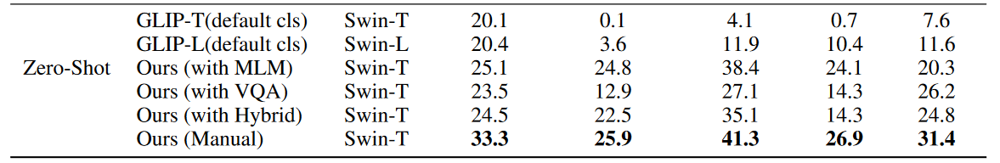

# Medical Image Understanding with Pretrained Vision Language Models: A Comprehensive Study
<!-- select Model and/or Data and/or Code as needed>
Welcome to OpenMEDLab! 👋

<!--
**Here are some ideas to get you started:**
🙋‍♀️ A short introduction - what is your organization all about?
🌈 Contribution guidelines - how can the community get involved?
👩‍💻 Useful resources - where can the community find your docs? Is there anything else the community should know?
🍿 Fun facts - what does your team eat for breakfast?
🧙 Remember, you can do mighty things with the power of [Markdown](https://docs.github.com/github/writing-on-github/getting-started-with-writing-and-formatting-on-github/basic-writing-and-formatting-syntax)
-->

---
<!-- Insert the project banner here -->
<div align="center">
    <a href="https://"></a>
</div>

---

<!-- Select some of the point info, feel free to delete -->

[](https://pypi.org/project/DI-engine/)


<!-- 
[](https://github.com/opendilab/DI-engine/stargazers)
[](https://github.com/opendilab/DI-engine/network) -->
<!-- 
[](https://github.com/opendilab/DI-engine/issues)
[](https://github.com/opendilab/DI-engine/pulls)
[](https://github.com/opendilab/DI-engine/graphs/contributors)
[](https://github.com/opendilab/DI-engine/blob/master/LICENSE) -->

Updated on 2023.06.08


## Introduction

This is a repository for the ICLR2023 accepted paper -- [Medical Image Understanding with Pretrained Vision Language Models: A Comprehensive Study.](https://arxiv.org/abs/2209.15517v2) 

- We propose a paradigm of prompt desgining that including expressive attributes into the prompts. We show that such prompts can help pre-trained Visual-Lanugage Models(VLM) rapidly adapt to unseen medical domain datasets. 
- We further propose three different approaches for automatical prompts generation, leveraging either specialized Language Models(LM) or VQA models to obtain.
- Our methods are evaluated by various public medical datasets. For more detail please refer to the [paper](https://arxiv.org/abs/2209.15517v2).

**ZeroShot Results**
<div align="center">
    <a href="https://"></a>
</div>
Our methods show superiority under zero-shot settings.
<!-- ## Links

- [Paper](https://)
- [Model](https://)
- [Code](https://)  -->
<!-- [Code] may link to your project at your institute>


<!-- give a introduction of your project -->
<!-- ## Details

intro text here.

<!-- Insert a pipeline of your algorithm here if got one -->
<!-- <div align="center">
    <a href="https://"></a>
</div>

More intro text here. -->


## Dataset

Due to the license factor, we can not share all the datasets we used in our work, but we upload the polyp benchmark datasets as sample. The polyp datasets are prepared by [PraNet](https://github.com/DengPingFan/PraNet.git) project, you can also download the data [here](https://github.com/DengPingFan/PraNet#31-trainingtesting). If someone wants to use their own dataset, please refer to the polyp datasets to organize their data paths and annotation files. 

|Netdisk Type|Link|Password(optional)|
| ------ | ------ | ------ |
|BaiduNetDisk| [link](https://pan.baidu.com/s/1E7gbvs3ljXUsyy4yvZQT-A?pwd=s2nf )|s2nf |
|Google Drive|[link](https://drive.google.com/file/d/10ISx1yXxfE20nKq6UqquUAD5Egk3hyqi/view?usp=sharing)| N/A

After you download this zip file, please unzip it and place the folder at the project path.

### DEMO
#### Interface
We also provide a interface space on huggingface for quick interaction with our approach. Please check this [link](https://drdoggo-medical-image-understanding-with-vlms.hf.space) for the interactable demo page.

<!-- <iframe
	src="https://drdoggo-medical-image-understanding-with-vlms.hf.space"
	frameborder="0"
	width="850"
	height="450"
></iframe> -->

#### Colab file
You can also check [this Colab](https://colab.research.google.com/drive/1S6MKq1g9ilnz4IFDsvZUqjZw_Lx3UGJ9?usp=sharing) script for code and training detail.

## Get Started

**Main Requirements**  
Our project is based on the GLIP project, so please first setup the environment for the GLIP model following [this instruction](https://github.com/microsoft/GLIP#introduction). Please make sure you download the GLIP-T Model weight [here](https://github.com/microsoft/GLIP#model-zoo) and put it under the MODEL/ path.
Next, please clone this repository and continue the installation guide in the next section.

**Installation**
```bash
git clone https://github.com/MembrAI/MIU-VL.git
pip install -r requirements.txt
```

#### Configuration Files
We follow the config file format used in the GLIP project. Please refer to the [sample config file]() we provided to create your own config file. **Note: The DATASETS.CAPTION_PROMPT content is ignore by our code, as our code use the automatically generated code instead of user inputted prompt.** 


#### Zero-shot Inference set-up guide
**Generate prompts with Masked Language Model(MLM) method**
In our work, we proposed three different methods to automatically generate prompts with expressive attributes. The first approach is the MLM method. To generate prompts with this approach, we need to use the pre-trained Language Models as our knowledge source. In this project, we use the [BiomedNLP-PubmedBERT-base](https://huggingface.co/microsoft/BiomedNLP-PubMedBERT-base-uncased-abstract-fulltext) model as our specialized language model. Please use the following code to download the model to this repo:
```bash
git lfs install
git clone https://huggingface.co/microsoft/BiomedNLP-PubMedBERT-base-uncased-abstract-fulltext
```

After you setup the depedencies we need for automatically generate prompts with MLM method, you can now generate prompts for your dataset. However, our code currently only support generate prompts with three expressive attributes -- color, shape, and location. We may improve our code in the future to support more kinds of attributes, but we found the three attributes we included are the most useful attributes for now.

Now, run the following codes to get the prompts generated with our MLM method.
```bash
bash RUN/autoprompt/make_auto_mlm.sh
```
or
```bash
python make_autopromptsv2.py --dataset 'kvasir' \
      --cls_names 'polyp' \
      --vqa_names 'wound'\
      --mode 'lama'\
      --real_cls_names 'bump'
```
where ``--dataset`` is the dataset name that will be used for searching related data paths. ``--cls_names`` indicates the class name in the template that used to extract the attributes information from the language model. For example, in this case, we will ask the LM to predict the masked word in the following template:"The typical color of **polyp** is [MASK] color ". Then the LM will predict the MASK token considering the given class name. ``--vqa_names`` is similar to the ``cls_names`` above, execept it is used for asking the VQA models later. ``--mode`` argument decide which approach of automated generation will be used, and 'lama' refers to the MLM method. Finally, ``real_cls_names`` is the real class name that you will put into the prompt. Sometimes, we found substitude the terminologies with general vocabularies may imrpove the performance. For example, we use bump, instead of polyp, in our final prompts, and we observe a significant improvement.

After running the command before, you will receive several .json files saved in the 'autoprompt_json/' folder. These json files stored all the generated prompts for each image input. To run the final inferece code, please type the following codes:
```bash
#!/bin/bash
config_file=path/to/config/file.yaml
odinw_configs=path/to/config/file.yaml
output_dir=output/path
model_checkpoint=MODEL/glip_tiny_model_o365_goldg.pth
jsonFile=autoprompt_json/lama_kvasir_path_prompt_top1.json

python test_vqa.py --json ${jsonFile} \
      --config-file ${config_file} --weight ${model_checkpoint} \
      --task_config ${odinw_configs} \
      OUTPUT_DIR ${output_dir}\
      TEST.IMS_PER_BATCH 2 SOLVER.IMS_PER_BATCH 2 \
      TEST.EVAL_TASK detection \
      DATASETS.TRAIN_DATASETNAME_SUFFIX _grounding \
      DATALOADER.DISTRIBUTE_CHUNK_AMONG_NODE False \
      DATASETS.USE_OVERRIDE_CATEGORY True \
      DATASETS.USE_CAPTION_PROMPT True\
```

**Generate image-specific prompts with VQA and Hybrid method**
Our approach need to use the OFA model for Visual-question answering tasks, and thus you need to follow this [guide](https://github.com/OFA-Sys/OFA/blob/main/transformers.md) to intall the OFA module with huggingface transformers. Note: We use the **OFA-base** model in this project. 
**For you convenience, you can simply run the following code to install the OFA model with huggingface transformers.** But we recommend you to refer to the user [guide](https://github.com/OFA-Sys/OFA/blob/main/transformers.md) in case there is any problem.
```bash
git clone --single-branch --branch feature/add_transformers https://github.com/OFA-Sys/OFA.git
pip install OFA/transformers/
git clone https://huggingface.co/OFA-Sys/OFA-base 
```

Here, we will show how to generate auto-prompts json files with Hybrid methods. 
```bash
python make_autopromptsv2.py --dataset 'kvasir' \
      --cls_names 'polyp' \
      --vqa_names 'bump'\
      --mode 'hybrid'\
      --real_cls_names 'bump'
```
or run the pre-defined bash file
```bash
bash RUN/autoprompt/make_auto_hybrid.sh
```
As we mentioned above, ```--mode``` argument decide which approach for prompts generation. 'hybird' and 'vqa' will activate the hybrid or vqa method respectively
**Note: runing the hybrid or vqa method will take hours to obtain the prompt file. We recommend to use a GPU with at least 24GB Memory to run this script**

Again, you will obtain several json files which have the autoprompts generated by our approach wrt each image input. If you can not run the script above due to the GPU limitation, we also provided some sample files under the autoprompt_json path. You can use these files as references and run the following code to do the inference with generated prompts:
```bash
config_file=path/to/config/file.yaml
odinw_configs=path/to/config/file.yaml
output_dir=output/path
model_checkpoint=MODEL/glip_tiny_model_o365_goldg.pth
jsonFile=autoprompt_json/hybrid_kvasir_path_prompt_top1.json

python test_vqa.py --json ${jsonFile} \
      --config-file ${config_file} --weight ${model_checkpoint} \
      --task_config ${odinw_configs} \
      OUTPUT_DIR ${output_dir}\
      TEST.IMS_PER_BATCH 2 SOLVER.IMS_PER_BATCH 2 \
      TEST.EVAL_TASK detection \
      DATASETS.TRAIN_DATASETNAME_SUFFIX _grounding \
      DATALOADER.DISTRIBUTE_CHUNK_AMONG_NODE False \
      DATASETS.USE_OVERRIDE_CATEGORY True \
      DATASETS.USE_CAPTION_PROMPT True\
```
### Fine-Tuning
We also finetuned the GLIP model with the medical data we collected. For convenience, we uploaded all the check pointed here for people who want to replicate our results. 

#### Checkpoints
**Non-radiology Checkpoints**
| DataSet | Weights | PASSWORD|
| ------ | ------ | ------ |
|Polyp| [Link](https://pan.baidu.com/s/1Ms8DzJpSURQeY3h-634-bQ)|1f8e|
|CPM17|[Link](https://pan.baidu.com/s/1oScdRiJmf28Dc3d50RJkNw)|ywyc|
|BCCD|[Link](https://pan.baidu.com/s/1U8zJpiESE0B31M29-ibTKw)|4wrb|
|ISIC2016|[Link](https://pan.baidu.com/s/1XJtuPJH-OFuFRIRu0QlbFA)|j7fc|
|DFUC2020|[Link](https://pan.baidu.com/s/1u3VNmxdN7i_vysv5k1yLtQ)|pbir|


**Radiology Dataset and Checkpoints**
| DataSet | Weights | PASSWORD|
| ------ | ------ | ------ |
| [LUNA16]() | [Link](https://pan.baidu.com/s/1krBdjx0DjiwExqYyygSy9Q) | tg5h |
| [ADNI]() | [Link](https://pan.baidu.com/s/1OlBSd9fE_U9LO_R6aujtvA) | dptg |
| [TN3k]() | [Link](https://pan.baidu.com/s/1v14Diesry2NvZRJiGx238A)| 596i |
| [TBX11k]() | [Link](https://pan.baidu.com/s/13n71sW3a6c1ZSN1GAaaQSw) | tv9s|


**Fine-Tune Results**
<div align="center">
    <a href="https://"></a>
</div>

## 🙋‍♀️ Feedback and Contact

- Emai: placeholder@tmp.com


## 🛡️ License

This project is under the CC-BY-NC 4.0 license. See [LICENSE](LICENSE) for details.

## 🙏 Acknowledgement

Our code is adapted from the [GLIP](https://github.com/microsoft/GLIP.git) project. And we also use the [OFA](https://huggingface.co/OFA-Sys) and [PubMedBert](https://huggingface.co/microsoft/BiomedNLP-PubMedBERT-base-uncased-abstract-fulltext) for auto-prompt generation. Thanks for their execellent works.

## 📝 Citation

If you find this repository useful, please consider citing this paper:
```
@article{Qin2022MedicalIU,
  title={Medical Image Understanding with Pretrained Vision Language Models: A Comprehensive Study},
  author={Ziyuan Qin and Huahui Yi and Qicheng Lao and Kang Li},
  journal={ArXiv},
  year={2022},
  volume={abs/2209.15517}
}
```

